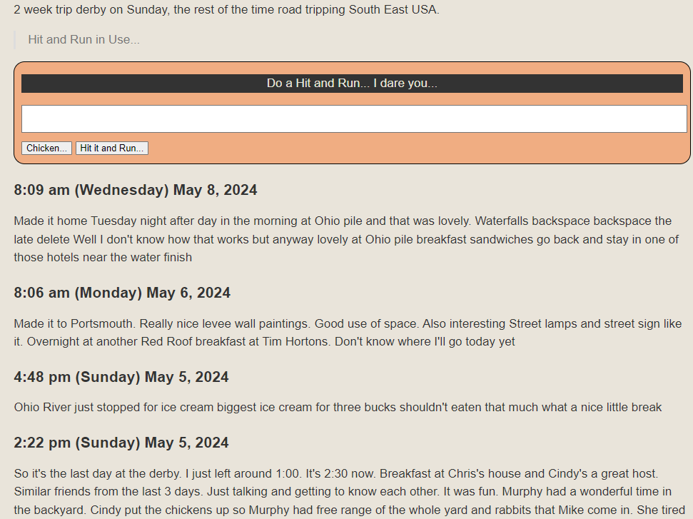

[Yellow CMS]: https://datenstrom.se/yellow/

# jacHitandRun 0.0.9

[Yellow CMS] Extension provides a quick note box on a page. It's just a note box form that saves the note in the page where you placed the box!   The box is only available when you are a yellow edit logged in user. 

[--more--]



## Description

Some context first.  I refer to myself as a "hit and run traveler".  On a road trip, I cover lots of miles.  I see friends along the way almost daily, but just stay for lunch, or dinner, or a nice conversation.  Then I get back on the road.  I very rarely stay overnight at someone's house, preferring cheap motels along the route.  I describe it as "Hit and Run" visits.  So the idea here is that if I am on a road trip, I set up a page for it, and put the "hit and run box" at the top of the page.  Whenever I have some thing noteworthy, I can tap the box, the keyboard pops up, and I tap the microphone, and say my note.  Google keyboard transcribes it into the form, and then I press save.  The extension time stamps the note and saves it in the same page.  When the trip is done. I remove the tag for the notebox. Later I have all my thoughts and reassemble them or discard them and create real posts or stories. 

## Getting Started

Place the ```[jachitandrun]``` tag on any page you want to track notes.

### Dependencies

There are no additional dependencies that need to be downloaded or installed.
- Yellow Edit core extension.   Uses only the check if logged in ability of the edit extension.  Nothing else.  If user logged in, show the **hitandrun box**.   
- Yellow CMS Version 0.9.3: You already got that or you wouldn't be here!

### Installing

1. Download the [Zip] File and extract into your yellow workers folder.
2. The structure of the files should be as shown. You will have to copy jachitandrun.php to the top workers folder.
Move files as needed to create this folder structure.

```
   +---workers
   |   |   jachitandrun.php
   |   |      
   |   +---jac
   |   |   |---+---other jac extensions
   |   |   |       
   |   |   |---+---jachitandrun
   |   |   |             jachitandrun-cfg.php
   |   |   |             jachitandrun-ext.php
   |   |   |             jachitandrun.php  (copy to workers above)
   |   |   |             layout-jachitandrun-form-inline.htm     
   |   |   |---+---other jac extensions
   
```

Note the file **workers/jachitandrun.php** is simply a method that allows me to choose where to put my extensions.  
I like to keep my stuff grouped together.

### Executing program

Add the ```[jachitandrun]``` tag to a page. For example the screenshot above started out as this page:

```
---
Title: Kentucky Derby 2024
TitleSlug: Kentuck Derby 2024
Published: 2024-04-04
Author: John
Layout: default
Tag: future
---

#Start Writing....

2 week trip derby on Sunday, the rest of the time road tripping South East USA.

[--more--]

[jachitandrun]

```

#### Configuration

The ```jachitandrun-cfg.php``` has the following default parameters. They can be changed in the config file.  Primarily be careful how you name your layouts.  They must begin with ```layout-jachitandrun-form-``` and you specify which form you want to use.  Right now, the only good form is ```inline```.

```
date_default_timezone_set('America/New_York');
$this->config = array(
    'jachitandrunDateformat' => "g:i a (l) F j, Y ",
    'jachitandrunLayout-inline' => 'layout-jachitandrun-form-inline.htm',
    'jachitandrunLayout-dialog' => 'layout-jachitandrun-form-dialog.htm',    
    'jachitandrunLayout-useform' => 'inline',
);

```

## Help

Some Help from author on github discussions or contact me.


## Authors

[https://github.com/jacmgr]

## Version History

* 0.0.X 2024-05-12

## License
I have no idea about licenses and need no ackknowledgement for my work. Use it if it makes you have some fun.

This project is licensed under the [NAME HERE] License - see the LICENSE.md file for details

## Acknowledgments

Thanks to [Datenstrom Yellow CMS team](https://datenstrom.se/yellow/).  It really is FUN!

