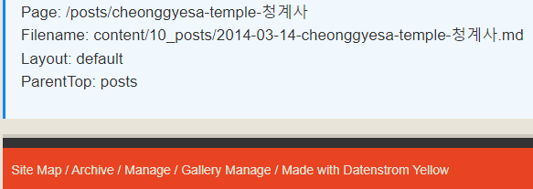

[Yellow CMS]: https://datenstrom.se/yellow/

# jacPageVars 0.0.9

[Yellow CMS] Extension to provide markdown page access to the page `meta variables`.  
> some examples in this readme show incorrectly because of the nature of the tags!  [See author's site.]([https://urichip.com/sites/devdocs/extensions](https://urichip.com/sites/devdocs/devdocs/jacextensions/)

As far as I know the yellow layouts DO include access to the META, however the MD PAGE itself does not.
This extension allows the page META to be used in markdown.   
This extension also allows you to add additional data variables or snippets to the Meta to be used in the page.
These additional variable are ALSO available in layouts using the page Meta object.
   
I refer to these collectively as **Page Variables (pagevars)**.

[--more--]


## Description

An example is probably better than a description.  
For context suppose that within your page markdown text you could enter 

~~~
---
Title: Readme - jacPageVars    
Author: jacmgr   
Published: 2024-02-14 12:41:30   
Lastupdate: 2024-03-25 12:41:30   
Tag: example   
---   
[ %author%] published **[ %title%]** for your pleasure on [ %lastupdate%].   
[ %author%] published **[ %title%]** for your pleasure on [datefmt "[ %lastupdate%]" "m-d-Y"].  
[ %author%] published **[ %title%]** for your pleasure on [datefmt "[ %lastupdate%]" "l d F Y" relative 5].   
[ %author%] published **[ %title%]** for your pleasure on [datefmt "[ %lastupdate%]" "l d F Y" relative 365].      
~~~


With this extension, Yellow would present a final parsed fragment of:

! jacmgr published **Readme - jacPageVars** for your pleasure on 2024-03-25 12:41:30.   
jacmgr published **Readme - jacPageVars** for your pleasure 03-25-2024.   
jacmgr published **Readme - jacPageVars** for your pleasure on Monday 25 March 2024.   
jacmgr published **Readme - jacPageVars** for your pleasure 11 days ago.   


**jacPageVars** is based on that concept, and your imagination. 
See the section for default supported PageVars.

! Note the pagevars can be used as INPUT to other Shortcuts as shown with the "datefmt" shortcut.

### Dependencies
There are no additional dependencies that need to be downloaded or installed.   
- yellow cms: You already got that or you wouldn't be here!

### Download and Install

1. Download the [Zip] File and extract into your yellow extensions folder.
2. The structure of the files should be as shown. You will have to copy **jacpagevars.php** to the top extensions folder. 
Move files as needed to create this folder structure.

```
   +---workers
   |   |   jacpagevars.php
   |   |      
   |   +---jac
   |   |   |---+---other jac extensions
   |   |   |       
   |   |   |---+---jacpagevars
   |   |   |          jacpagevars-cfg.php
   |   |   |          jacpagevars-ext.php
   |   |   |          jacpagevars.php
   |   |   |       
   |   |   |---+---other jac extensions
   
```

Note the file **workers/jacpagevars.php** is simply a method that allows me to choose where to put my extensions. 
I like to keep my stuff grouped together.

```php
<?php
require_once 'jac/jacpagevars/jacpagevars-ext.php';
```

### Using in your Site

Each of the PageVars may be used in your page and **requires the opening tag of `[%` and the closing tag of `%]`** as shown above example. 
At some point the delimeter could be made configurable in the config file.
There should be **NO spaces** in the opening tag. (spaces shown in examples to avoid processing this readme by the extension!)

| Yellow Meta      | jacPageVars  |   jacConfig Samples    |
| ------------------ | -------------------------- | ----------------------- |
|    [% title]    |
|    [% language]    |[% baseurl%]     | [% BYOB%]  |
|    [% modified%]    |	[% pagelocation%]    |  [% DailyMessage%] |
|    [% sitename%]    |[% pagefilename%]    |  [% currenttimestamp%] |
|    [% author%]    |[% parenttop%]    |  [% currentdate%] |
|    [% layout%]    |[% home%]    |  [% currenttime2%] |
|    [% theme%]    |   |   |[% wikipedia%]
|    [% parser%]    |   |   |[% yellocms%]
|    [% status%]    |   |  [% %] |
|    [% titleNavigation%]    |   |  [% %] |
|    [% published%]    |   |  [% %] |
|    [% titleContent%]    |   |  [% %] |
|    [% titleHeader%]    |   |  [% %] |
|    [% editPageUrl%]    |   |  [% %] |


### Configurations

The configuration allows you to add whateve you want that works as a text substitution. Use functiuons that return a text value.

```php
$this->config = array(
	'BYOB' => " ** Bring Your Own Bottle ** ",
	'DailyMessage' => 'Call some function that returns text',
	'currenttimestamp' => time(),
	'currentdate' => date("Y-m-d", time()),
	'currenttime2' =>'[datetimefmt "[%currentdate%]" "l d F Y" ]',
	'wikipedia' => 'https://en.wikipedia.org/wiki/?',
	'yellocms' => 'https://datenstrom.se/',
);
```

### Using in your Site

Just like the examples:  `[%pagevarename%]`.

> [Search wikipedia]([% wikipedia%])France

> [Search wikipedia](https://en.wikipedia.org/wiki/?France)

> Todays party is [% BYOB%].   
> Todays party is ** Bring Your Own Bottle **

### More complicated use.

I use a footer at the bottom of the page in the content area. That footer is called from the layout after the content.,

```
	<?php 
	      echo $this->yellow->page->getContentHtml() ;
	      //  just admin info at bottom of page.
		  echo $this->yellow->page->getPage("footer-content")->getContentHtml();
	?>
```

The page **footer-content.md** lives in the **shared folder**.  The contents are:

```
---
Title: Footer-Content
---
<div class="clearboth" markdown="1"></div>
!!! <a id="bottom" /><small>[TOP](#top)  |  <a href="[% externalediturl%]">External Edit This File</a></small>   
Page: [% pagelocation%]   
Filename: [% pagefilename%]  
Layout: [% layout%]   
ParentTop: [% parenttop%]
```

This effectively put the footer-content on the bottem of every page without writing php code in the layout. Works well for this situation. Of course more complicated footers would need to use layout and php.


What's the point?  Helps me a lot when when I was young and couldn't grasp yellow changeing page names.  
Helps understand why yellow does it.  When the sites done I'll change the footer-content to `[% BYOB%]`.  


## Help

Some Help from author on github discussions. 

## Authors

[https://github.com/jacmgr]


## Version History

* 0.0.X 2024-04-05

## License

I have no idea about licenses and need no ackknowledgement for my work. Use it if it makes you have some fun.

This project is licensed under the [NAME HERE] License - see the LICENSE.md file for details

## Acknowledgments

Thanks to [Datenstrom Yellow CMS team](https://datenstrom.se/yellow/).  It really is FUN!
