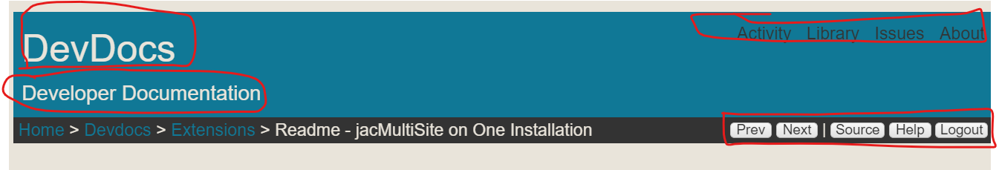

[Yellow CMS]: https://github.com/datenstrom/yellow

# jacSiteCfg 0.0.9

[Yellow CMS] Extension to provide a method of configuring similar sites using similar customized templates. Used when you are using a MULTIPLE Sites that may use the same customized theme or layout files.

[--more--]

## Description

This wonky, and only a proof of concept.  DO NOT USE.  This works well for a quick prototype using your existing already customized themes.
I am doing this because all of my hobby sites [use a single installation of the yellow system](./readme-jacmultisite-on-one-installation).  It is convenient, but the techniques I used to do it may not be appropriate for things you consider important, or, commercial or production sites.

The basic configuration i use is shown below from a file located adjacent to your yellow.php file and named **jacsite-cfg.php**.

```
// =======================================
//  USER CONFIG SITE VARIABLE TEXT
// =======================================
// Site Custom Variables.
// Will override or add to yellow-system.ini
// Mainly used in Layouts.
// Content Elements, Themes, Layouts
// ----------------------------------------------------
// siteCode is a folder name, and usually the theme name and 
$JACsiteCode = "ibrowser";
// Content folder has lots of possibilities in yellow...
// content/ is the yellow default but yellow ALLOWS almost anything, i.e. sites/urichip/files/ 
$JACcontentFolder = 'content/';  // Make sure ends in slash!!

// Pages to include in the Main Navigation
// My theme navigation.html Layout uses this array.
// I do not often use the yellow method of number prefixes on folders...
$jacNavigation = array(
	'/',
	'/blog/',
	'/about/imagebrowser',
	'/about/',
);
// My themes have a kind of breadcrumb bar that also has some nav items on it.
// FULL SUBNAVIGATION
/*
$jacSubNavigation = array(
	'Paginate',
	'|',
	'Source',
	'Help',
	'Signin'
);
*/
// This site only uses some of them
// Partial Subnavigation
$jacSubNavigation = array(
	'Source',
	'Help',
);
//  NO subnavigation.....only breadcrumb
/*
$jacSubNavigation = array();
*/

// Site Name and Byline Used in Theme header/footer Layouts
$jacSitename = 'Image Selector and Passwords';
$jacSitebyline = 'Testing and Developing an Image Selection Tool';
$jacSiteTheme =  $JACsiteCode;
// Default Author on New Pages
$jacAuthor = 'jacmgr';
```

The variables and options are tightly integrated to however you have customized your theme and LAYOUTS.  You can notice that I essentially have 6 sites running basically the same them/layouts with subtle differentiation that has been included in the particular sites config file.

In the extensions onload event:
~~~
    public function onLoad($yellow) {
	$this->yellow = $yellow;
// the cfg file lives in the root folder for this one.  Maybe should live here.......??
	include './'.'jacsite-cfg.php';
	if (!isset($jacSitename)) {$jacSitename = 'Give Your Site a name in jacsite-cfg.php';}
	if (!isset($jacSiteTheme)) {$jacSiteTheme = 'default';}
	if (!isset($jacSubNavigation)) {$jacSubNavigation = array('Paginate', '|', 'Source', 'Help', 'Signin'); }
	$jacConfig = array(
		'Sitename' => $jacSitename,
		'Sitebyline' => $jacSitebyline,
		'Author' => $jacAuthor,
		'Sitecode' => $JACsiteCode,
		'Theme' => $jacSiteTheme,
		'NavigationPages'=> $jacNavigation,
		'SubNavigationPages'=> $jacSubNavigation,
		'coreContentDirectory' => $JACcontentFolder,
        );	 	

	foreach ($jacConfig as $setting => $value){
		$this->yellow->system->setDefault($setting, $value);
		$this->yellow->system->set($setting, $value);
	}
~~~


## Getting Started

!!  Don't!!  Figure out your own way to do this if you really think you need to.  I have no files for you.  In any case, the entire extension is above.  Just the onload method!!  Now those vars are available to you throughout your Layouts and extensions.

### Dependencies

Don't do it......

### Installing

Don't do it......

### Executing program

Don't do it......

## Help

Don't Do it!

## Authors

Contributors names and contact info

## Version History

## License

This project is licensed under the [NAME HERE] License - see the LICENSE.md file for details

## Acknowledgments
